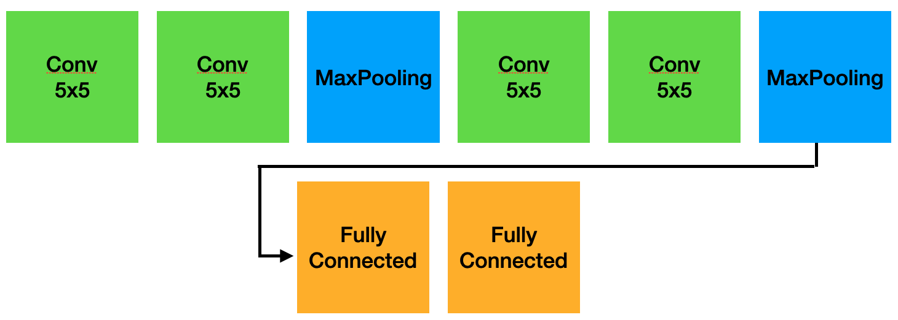
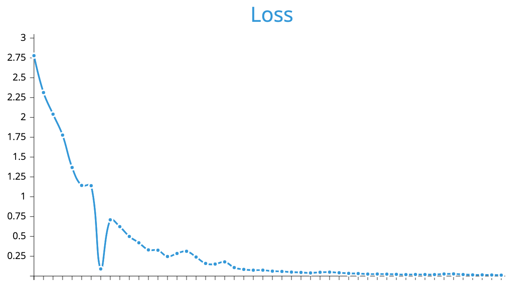
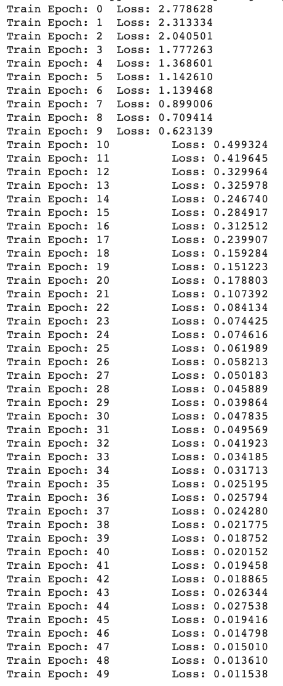
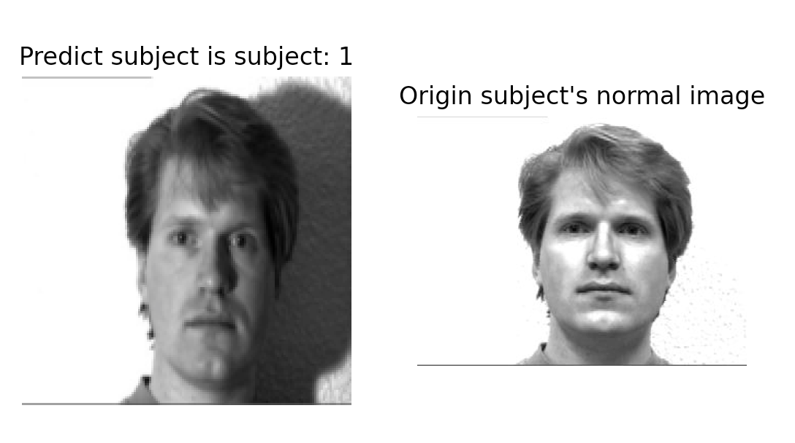
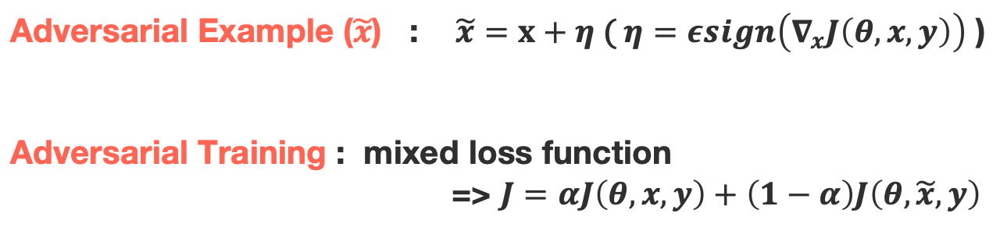
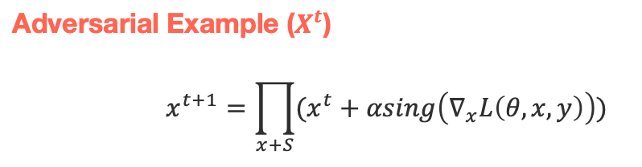

# Recognition model using Yale Face Datset  
  - [Manual](#manual)
  - [Model Architecture](#model)
  - [Algorithm](#algorithm)
  - [Performance & Demo](#performance--demo)
  - [Reference](#reference)
  - [Evasion Examples](#evasion-examples)

## Manual
- __Setting__
  1. git clone this repo
  2. source bin/activate
  3. pip install -r requirements.txt
- __Train a model and Save as model.pt & Test accuracy__
  1. python main.py --execTrain 1 --saved 1
       - If don't want to save the model, ignore --saved option
- __Demo__
  - python demo.py

## Model
### Original Model

> Kernel Size = 5 
> Stride = 2 
> Final Output **#** = 15

## Performance & Demo
- Epoch : 50 / Learning Rate : 0.01
- Loss

 

- Accuracy

- Demo
  - Select random image from original 164 data and predict
  - The normal image of the predicted is shown for compare

## Evasion Examples
### Model trained with FGM Examples

> Create FGM Adversarial Example by using **art.attacks.evasion.FastGradientMethod** 
> The training method was carried out as shown in **"EXPLAINING AND HARNESSING ADVERSARIAL EXAMPLES"**.

[More Details for CNN Model trained with FGM Examples](https://github.com/sonhl0723/yale-face-dataset-recognition/blob/main/FGM_adversarial_training_model.ipynb)

### Model trained with PGD Examples

> Create FGM Adversarial Example by using **art.attacks.evasion.ProjectedGradientDescent** 
> The training method was carried out as shown in **"Towards Deep Learning Models Resistant to Adversarial Attacks"**.

[More Details for CNN Model trained with PGD Examples](https://github.com/sonhl0723/yale-face-dataset-recognition/blob/main/PGD_adversarial_training_model.ipynb)

### Compare with Original Model
||Original Model|FGM Model|PGD Model|
|---|:-----------:|:-----------:|:-----------:|
|Original Examples|0.882|__0.941__|0.852|
|FGM Examples|0.5|__0.941__|__0.941__|
|BIM Examples|0.058|__0.941__|__0.941__|
|PGD Examples|0.029|0.852|__0.970__|

[More Details for Performance](https://github.com/sonhl0723/yale-face-dataset-recognition/blob/main/Evasion_Test.ipynb)

## Reference
- Ian J. Goodfellow, Jonathon Shlens & Christian Szegedy, "EXPLAINING AND HARNESSING ADVERSARIAL EXAMPLES", ICLR 2015
- Alexey Kurakin, Ian J. Goodfellow, Samy Bengio, "ADVERSARIAL EXAMPLES IN THE PHYSICAL WORLD", ICLR 2017
- Aleksander Ma ̨dry, Aleksandar Makelov, Ludwig Schmidt, "Towards Deep Learning Models Resistant to Adversarial Attacks", stat.ML 4 Sep 2019
- UCSD Computer Vision, Yale Face Database [Download](http://vision.ucsd.edu/content/yale-face-database)
- Adversarial-Robustness-Toolbox [Link](https://adversarial-robustness-toolbox.readthedocs.io/en/latest/modules/attacks/evasion.html)